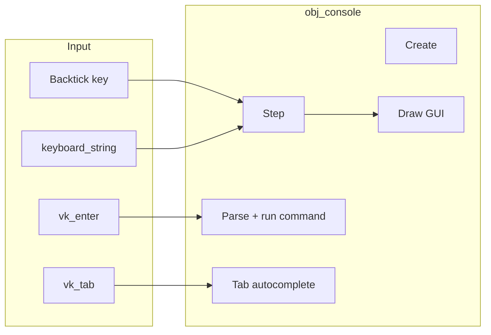

# Debug Console (room command + Tab autocomplete)

## Scope

- **This plan:** Console shell + `room <room-name>` with Tab autocomplete; console excluded from final build.
- **Later (not implemented here):** `inv <item> <action>` — leave a clear extension point (command registry or switch) so the team can add it next.

## Architecture




- **Single object:** `obj_console` (new). Keep existing [obj_debug](objects/obj_debug/obj_debug.yy) as-is (L key → rm_test).
- **Persistence:** Make `obj_console` **persistent** and place it once in [rm_menu](rooms/rm_menu/rm_menu.yy) so it exists in all rooms.
- **Input capture:** When console is open, set `global.console_open = true` so other objects (e.g. [obj_player](objects/obj_player/Step_0.gml)) can skip input if desired. Read `keyboard_string` each Step and append to a buffer, then set `keyboard_string = ""` to avoid double handling. Handle Enter (run), Tab (autocomplete), Escape (close).
- **Rendering:** Use **Draw GUI** (Draw_64) so the console is always in screen space: e.g. bar at bottom (or top), prompt `>`  + input buffer, optional line for autocomplete hints.

## Key implementation details

### 1. Console toggle and state

- **Key:** Use backtick

``` — `ord("`") `is 96. (On US keyboards, **~** is Shift+`; if you want ~ instead, use the same key and document “press ~” in help.)

- **State (Create):** `console_open = false`, `input_buffer = ""`, `history` (optional), `autocomplete_index` for Tab cycling.
- **Toggle:** In Step, when

``` is pressed and console is closed: set `console_open = true`, clear buffer, optionally set `keyboard_string = ""`. When open and 

``` or Escape: set `console_open = false`, clear buffer.

### 2. Room command and room list

- **Command:** `room <room-name>` (e.g. `room rm_plains`). Parse the line: if first word is `"room"`, second word is the room name.
- **Room resolution:** GameMaker does not expose “all rooms” by string at runtime. Use a **script that returns a fixed array of room asset references** so the compiler does not strip them, e.g.:
  - `[rm_plains, rm_menu, rm_test, rm_credits, rm_win, rm_forest, rm_lose, rm_inventory]`
- **Lookup:** For a typed name, find the room in that array where `room_get_name(room_id)` equals (or starts-with for autocomplete) the typed string. Then call `room_goto(room_id)`.
- **Validation:** If no room matches, show a one-line message in the console (e.g. “Unknown room: ”) or list valid names.

### 3. Tab autocomplete

- **Context:** Only when the first word is `"room"` — the “current word” is the second token (the room name being typed).
- **Logic:** Collect all room names from the script array that **start with** the current word (case-insensitive or exact, your choice). If one match: replace the current word with that name. If multiple: either (a) complete to the **longest common prefix** and show the list below the prompt, or (b) Tab cycles through matches and inserts the selected one. Option (b) is more discoverable for kids.
- **Tab key:** `keyboard_check_pressed(vk_tab)` in Step when console is open. After applying completion, set `keyboard_string = ""` so Tab doesn’t insert a tab character.

### 4. Keeping the console out of the final build

- **Macro:** In **Project Options → Macros**, define a macro (e.g. `DEBUG_CONSOLE`) and set it to `1` for the **Default** (development) config and `0` (or leave undefined and check with `variable_global_exists`) for a **Release** config when you add one.
- **Guard in obj_console:** In Create, if `DEBUG_CONSOLE` is 0 or not set, call `instance_destroy()` and exit. No Step/Draw logic runs, so the console is effectively disabled. The object can stay in the room list; you do not need to remove it from every room for release.
- **Docs:** In [docs/TASKS.md](docs/TASKS.md) or [docs/DESIGN.md](docs/DESIGN.md), note that the release build must use a config with the console disabled (and optionally that the console is for dev/test only).

## File and asset changes


| Item                     | Action                                                                                                                                                      |
| ------------------------ | ----------------------------------------------------------------------------------------------------------------------------------------------------------- |
| **Script: room list**    | New script (e.g. `scr_debug_room_list`) that returns an array of room asset refs `[rm_plains, rm_menu, ...]`.                                               |
| **Script: room command** | New script (e.g. `scr_debug_cmd_room`) that takes the rest of the line (room name), resolves it via the list, calls `room_goto` or returns an error string. |
| **obj_console**          | New object: Create (state, macro guard), Step (toggle, buffer, Enter, Tab, autocomplete), Draw_64 (prompt + buffer + optional autocomplete line).           |
| **Room placement**       | Add one instance of `obj_console` in `rm_menu`, set object to **persistent** in the object properties.                                                      |
| **Project options**      | Add macro `DEBUG_CONSOLE = 1` for Default config (and later `0` for Release).                                                                               |
| **Optional**             | If you want the player to ignore movement while console is open, in `obj_player` Step check `global.console_open` and skip key handling when true.          |


## Command parsing (extensible for `inv` later)

- In Step, when Enter is pressed: trim `input_buffer`, split on spaces (respect quotes if you want later). First token = command name.
- Use a simple **switch** or **if/else** on command name: `"room"` → call `scr_debug_cmd_room(rest_of_line)`. Later add `"inv"` → call a future `scr_debug_cmd_inv(...)`.
- This keeps the door open for `inv <item> <action>` without refactoring.

## Testing

- Run from `rm_menu`, press

```, type `room rm_` and Tab: should complete or cycle to `rm_plains` (and others). Run `room rm_plains`, then `room rm_forest`, etc.

- Build with `DEBUG_CONSOLE = 0`: console should not appear and object should destroy itself in Create.

## Summary

- New **obj_console** (persistent, in rm_menu), toggle with

```, Draw GUI for prompt and buffer.
- New **scr_debug_room_list** (room refs) and **scr_debug_cmd_room** (parse + room_goto).
- **Tab** autocomplete for `room <name>` using the room list; optional Tab cycling for multiple matches.
- **DEBUG_CONSOLE** macro and Create guard so the console is omitted from the final build.
- Parsing structured so **inv** can be added next as another command branch.

```

